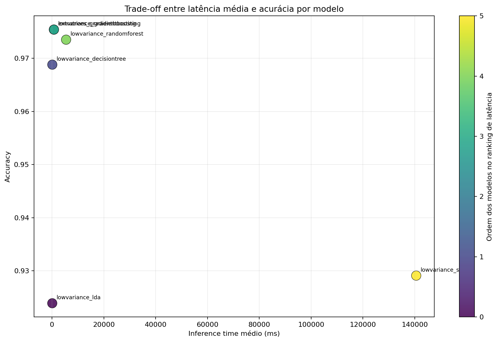
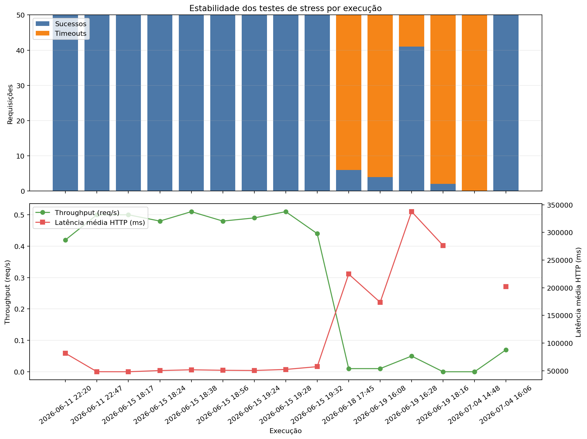

# Relatório de Stress Test da API de Inferência MQTT

**Data de geração:** 2026-07-15 23:12
**Fonte dos dados:** arquivos JSON/CSV em `api_inference/results_inference/`
**Alvo do stress test:** API de inferência no Raspberry Pi via `/benchmark`

## 1. Contexto do experimento

Os artefatos desta pasta registram a execução da API de inferência sob carga concorrente. A API de stress dispara requisições HTTP contra o Raspberry Pi e mede latência, throughput, taxa de falha, timeouts e o comportamento por modelo.

## 2. Resumo executivo

- Modelo mais rápido no conjunto consolidado: **lowvariance_lda** (94.585 ms).
- Melhor compromisso entre velocidade e qualidade observado: **lowvariance_gradientboosting** (718.653 ms, accuracy 0.9754).
- Maior acurácia entre os modelos consolidados: **lowvariance_gradientboosting** (0.9754).
- O ambiente mostra sinais claros de saturação sob concorrência alta: aumenta a fila, sobe a latência média e surgem timeouts.

## 3. Tabela consolidada dos modelos

| speed_rank | model_id | n_requests | inference_time_ms_avg | inference_time_ms_p50 | inference_time_ms_min | inference_time_ms_max | inference_time_ms_ci95_lower | inference_time_ms_ci95_upper | accuracy |
| --- | --- | --- | --- | --- | --- | --- | --- | --- | --- |
| 1 | lowvariance_lda | 50 | 94.585 | 82.234 | 31.517 | 288.097 | 79.206 | 109.965 | 0.924 |
| 2 | lowvariance_decisiontree | 50 | 117.122 | 95.798 | 25.804 | 992.081 | 78.287 | 155.957 | 0.969 |
| 3 | lowvariance_gradientboosting | 50 | 718.653 | 692.885 | 238.203 | 1927.916 | 609.378 | 827.929 | 0.975 |
| 4 | extratrees_gradientboosting | 50 | 759.977 | 747.433 | 250.342 | 1670.834 | 656.827 | 863.127 | 0.975 |
| 5 | lowvariance_randomforest | 50 | 5438.23 | 4897.255 | 2405.442 | 10293.727 | 4765.364 | 6111.095 | 0.974 |
| 6 | lowvariance_svm | 50 | 140553.16 | 146159.933 | 93890.297 | 172891.736 | 134194.929 | 146911.391 | 0.929 |

## 4. Legenda das métricas

| Campo | Significado | Leitura prática |
|---|---|---|
| `inference_time_ms_avg` | Média do tempo de inferência por requisição | Principal métrica para comparar rapidez dos modelos |
| `inference_time_ms_p50` | Mediana do tempo de inferência | Mostra o comportamento típico sem os extremos |
| `inference_time_ms_min/max` | Menor e maior tempo observado | Indicam dispersão e caudas de latência |
| `inference_time_ms_ci95_lower/upper` | Intervalo de confiança de 95% | Ajuda a avaliar estabilidade estatística |
| `accuracy` | Proporção de acertos | Mede qualidade preditiva, mas não substitui latência |
| `concurrency` | Requisições simultâneas enviadas pela API de stress | Mede pressão concorrente sobre o Raspberry Pi |
| `requests` | Total de requisições no teste | Define o tamanho da amostra do teste |
| `successful` / `failed` / `timeouts` | Resultado agregado das requisições | Indicam estabilidade operacional sob carga |
| `throughput_req_per_sec` | Vazão de requisições por segundo | Mostra capacidade efetiva de processamento |
| `latency_avg_ms` / `latency_p95_ms` | Latência HTTP da requisição de stress | Reflete o comportamento da API como serviço |
| `load_before` / `load_after` | Load average do Raspberry Pi antes/depois | Mostra o impacto sistêmico do teste |
| `memory_used_before_mb` / `memory_used_after_mb` | Memória usada antes/depois do teste | Indica se o stress aumentou o consumo de RAM durante a execução |

## 5. Resumo das execuções de stress

| timestamp | filename | concurrency | requests | successful | failed | timeouts | throughput_req_per_sec | latency_avg_ms | latency_p95_ms | load_before | load_after | memory_used_before_mb | memory_used_after_mb |
| --- | --- | --- | --- | --- | --- | --- | --- | --- | --- | --- | --- | --- | --- |
| 2026-06-11T22:20:35Z | t01_workers4_concurrency50_allmodels.json | 50 | 50 | 50 | 0 | 0 | 0.42 | 81433.42 | 118343.04 | 0.16 | 4.7 | 2087 | 2411 |
| 2026-06-11T22:47:31Z | t02_workers4_concurrency30_allmodels.json | 30 | 50 | 50 | 0 | 0 | 0.5 | 48161.44 | 61663.03 | 0.09 | 9.25 | 2393 | 2481 |
| 2026-06-15T18:17:26Z | t03_workers4_concurrency30_allmodels_run01.json | 30 | 50 | 50 | 0 | 0 | 0.5 | 48081.18 | 61107.53 | 0.06 | 8.63 | 2646 | 2711 |
| 2026-06-15T18:24:41Z | t04_workers4_concurrency30_allmodels_run02.json | 30 | 50 | 50 | 0 | 0 | 0.48 | 50237.62 | 65981.89 | 0.29 | 9.46 | 2287 | 2736 |
| 2026-06-15T18:38:39Z | t05_workers4_concurrency30_allmodels_run03.json | 30 | 50 | 50 | 0 | 0 | 0.51 | 51639.67 | 66392.62 | 0.25 | 11.37 | 2305 | 2748 |
| 2026-06-15T18:56:53Z | t06_workers4_concurrency30_allmodels_run04.json | 30 | 50 | 50 | 0 | 0 | 0.48 | 50744.5 | 65083.41 | 0.4 | 9.41 | 2347 | 2752 |
| 2026-06-15T19:24:19Z | t07_workers4_concurrency30_allmodels_run05.json | 30 | 50 | 50 | 0 | 0 | 0.49 | 50364.05 | 62667.82 | 0.57 | 8.15 | 2339 | 2786 |
| 2026-06-15T19:28:40Z | t08_workers4_concurrency30_allmodels_run06.json | 30 | 50 | 50 | 0 | 0 | 0.51 | 52247.12 | 67044.5 | 1.26 | 12.23 | 2382 | 2802 |
| 2026-06-15T19:32:03Z | t09_workers4_concurrency30_allmodels_run07.json | 30 | 50 | 50 | 0 | 0 | 0.44 | 57301.41 | 104705.72 | 2.87 | 6.76 | 2365 | 2805 |
| 2026-06-18T17:45:43Z | t10_workers4_concurrency30_svm_firstattempt.json | 30 | 50 | 6 | 44 | 44 | 0.01 | 224644.46 | 237323.04 | 0.42 | 13.16 | 2202 | 2693 |
| 2026-06-19T16:08:52Z | t11_workers4_threads100_concurrency30_svm.json | 30 | 50 | 4 | 46 | 46 | 0.01 | 173618.77 | 179038.93 | 0 | - | 2011 | - |
| 2026-06-19T16:28:59Z | t12_workers4_threads50_concurrency30_svm.json | 30 | 50 | 41 | 9 | 9 | 0.05 | 337488.6 | 404241.22 | 0.1 | 6.65 | 2466 | 2498 |
| 2026-06-19T18:16:55Z | t13_workers4_threads40_concurrency30_svm.json | 30 | 50 | 2 | 48 | 48 | 0 | 276368.77 | 298086.98 | 0.67 | 19.5 | 2398 | 2490 |
| 2026-07-04T14:48:21Z | t14_workers4_concurrency30_allmodels_timeout01.json | 30 | 50 | 0 | 50 | 50 | 0 | - | - | 1.29 | - | 2018 | - |
| 2026-07-04T14:48:40Z | t15_workers4_concurrency30_allmodels_timeout02.json | 30 | 50 | 0 | 50 | 50 | 0 | - | - | - | - | - | - |
| 2026-07-04T16:06:55Z | t16_workers4_concurrency15_allmodels.json | 15 | 50 | 50 | 0 | 0 | 0.07 | 202147.02 | 256146.07 | 0.62 | 7.18 | 2005 | 2353 |

## 6. Destaque do SVM e divergências observadas

### 6.1 Runs específicos com SVM

| timestamp | filename | concurrency | requests | successful | failed | timeouts | throughput_req_per_sec | latency_avg_ms | model_inference_time_ms_avg | model_inference_time_ms_p50 | model_inference_time_ms_min | model_inference_time_ms_max | model_accuracy | load_before | load_after |
| --- | --- | --- | --- | --- | --- | --- | --- | --- | --- | --- | --- | --- | --- | --- | --- |
| 2026-06-18T17:45:43Z | t10_workers4_concurrency30_svm_firstattempt.json | 30 | 50 | 6 | 44 | 44 | 0.01 | 224644.46 | 90213.763 | 88414.257 | 81095.332 | 109130.934 | 0.929 | 0.42 | 13.16 |
| 2026-06-19T16:08:52Z | t11_workers4_threads100_concurrency30_svm.json | 30 | 50 | 4 | 46 | 46 | 0.01 | 173618.77 | 62773.226 | 56967.594 | 54823.173 | 82334.542 | 0.929 | 0 | - |
| 2026-06-19T16:28:59Z | t12_workers4_threads50_concurrency30_svm.json | 30 | 50 | 41 | 9 | 9 | 0.05 | 337488.6 | 237211.473 | 259992.121 | 29061.943 | 315047.372 | 0.929 | 0.1 | 6.65 |
| 2026-06-19T18:16:55Z | t13_workers4_threads40_concurrency30_svm.json | 30 | 50 | 2 | 48 | 48 | 0 | 276368.77 | 230217.6 | 230217.6 | 208364.802 | 252070.398 | 0.929 | 0.67 | 19.5 |
| 2026-07-04T16:06:55Z | t16_workers4_concurrency15_allmodels.json | 15 | 50 | 50 | 0 | 0 | 0.07 | 202147.02 | 140553.16 | 146159.933 | 93890.297 | 172891.736 | 0.929 | 0.62 | 7.18 |

### 6.2 Comparação do SVM com os modelos leves e com os demais pesos do conjunto

| model_id | inference_time_ms_avg | accuracy | x_lda | x_decisiontree | x_gradientboosting | x_extratrees |
| --- | --- | --- | --- | --- | --- | --- |
| lowvariance_lda | 94.585 | 0.924 | 1 | 0.808 | 0.132 | 0.124 |
| lowvariance_decisiontree | 117.122 | 0.969 | 1.238 | 1 | 0.163 | 0.154 |
| lowvariance_gradientboosting | 718.653 | 0.975 | 7.598 | 6.136 | 1 | 0.946 |
| extratrees_gradientboosting | 759.977 | 0.975 | 8.035 | 6.489 | 1.058 | 1 |
| lowvariance_randomforest | 5438.23 | 0.974 | 57.496 | 46.432 | 7.567 | 7.156 |
| lowvariance_svm | 140553.16 | 0.929 | 1485.998 | 1200.058 | 195.579 | 184.944 |

- Em relação ao **lowvariance_lda**, o SVM é cerca de **1486.0x** mais lento.
- Em relação ao **lowvariance_decisiontree**, o SVM é cerca de **1200.1x** mais lento.
- Em relação ao **lowvariance_gradientboosting**, o SVM é cerca de **195.6x** mais lento.
- Em relação ao **extratrees_gradientboosting**, o SVM é cerca de **184.9x** mais lento.
- Nos runs específicos do SVM, a taxa de sucesso variou de **2/50** até **50/50**, mostrando que o gargalo não é apenas a precisão do modelo, mas o acúmulo de fila e o tempo de resposta do Raspberry Pi.
- O run consolidado de **lowvariance_svm** ainda fecha todas as requisições em carga mais baixa, mas o custo médio de inferência permanece em **140553.16 ms**, muito acima do restante do conjunto.

## 7. Interpretação dos resultados

1. O menor tempo de inferência não é o único critério relevante. O modelo mais rápido tende a sacrificar um pouco de acurácia, mas entrega o melhor comportamento quando a prioridade é resposta ágil.
2. Modelos de boosting oferecem acurácia alta, porém a latência cresce rapidamente sob concorrência, o que pressiona o Raspberry Pi.
3. RandomForest e SVM são os mais custosos em tempo de inferência e os mais sensíveis a filas e timeouts em cenários agressivos de stress.
4. A estabilidade do sistema depende menos da leitura dos dados e mais da etapa de `predict`, que é onde o custo computacional realmente se concentra.
5. O aumento de `concurrency` sem ajuste de threads/cores no Pi produz degradação evidente: throughput baixo, latências altas e maior risco de timeout.

## 8. Figuras

### 8.1 Trade-off entre latência e acurácia

### 8.2 Estabilidade por execução

## 9. Conclusão

Os dados sugerem que o sistema no Raspberry Pi deve ser tratado como um ambiente de borda sensível a concorrência. Para operação prática, o melhor caminho é equilibrar latência e acurácia, evitando modelos muito pesados quando a carga simultânea for alta. O SVM é o caso mais extremo de divergência: ele não adiciona ganho de precisão suficiente para compensar o salto de latência e os timeouts observados nos runs mais pesados. O gráfico de trade-off ajuda a escolher o modelo; o gráfico de estabilidade mostra quando o Pi começa a saturar.

## 10. Próximo passo recomendado

Adicionar um segundo experimento com a mesma carga lógica, mas variando `concurrency` de forma controlada para identificar o ponto de inflexão de saturação do Raspberry Pi e formalizar o limite operacional recomendado.
