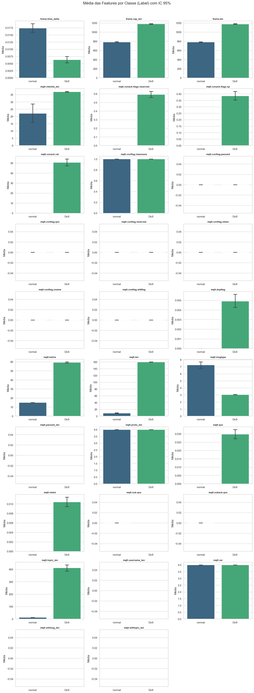

# MQTT Under Attack documentation!

## 📂 Dataset Utilizado

Este projeto utiliza como objeto de estudo o **MQTT_UAD (MQTT Under Attack Dataset)**, um conjunto de dados público focado na detecção de ataques em redes IoT baseadas no protocolo MQTT.

**Referência Original:**
> Alaiz-Moretón, Héctor; Aveleira-Mata, Jose Antonio; Díez Fernández, Saúl; Muñoz Castañeda, Ángel Luis; García-Rodríguez, Isaías; Benavides, Carmen; Benítez-Andrades, José Alberto (2023). **MQTT_UAD: MQTT Under Attack Dataset. A public dataset for the detection of attacks in IoT networks using MQTT protocol**. figshare. Dataset. 
> DOI: [10.6084/m9.figshare.24420958.v1](https://doi.org/10.6084/m9.figshare.24420958.v1)

**Licença:**
O dataset é distribuído sob a licença [CC BY 4.0](https://creativecommons.org/licenses/by/4.0/).

## Observação de licença de uso

Esse projeto 

## Features primariamente selecionadas para a análise

Index(['frame.time_delta', 
'frame.cap_len',
 'frame.len', 
 'mqtt.clientid_len',
'mqtt.conack.flags.reserved',
'mqtt.conack.flags.sp',
'mqtt.conack.val',
       'mqtt.conflag.cleansess',
        'mqtt.conflag.passwd', 
        'mqtt.conflag.qos',
       'mqtt.conflag.reserved', 
       'mqtt.conflag.retain',
        'mqtt.conflag.uname',
       'mqtt.conflag.willflag', 
       'mqtt.dupflag',
        'mqtt.kalive', 
        'mqtt.len',
       'mqtt.msgtype', 
       'mqtt.passwd_len', 
       'mqtt.proto_len', 
       'mqtt.qos',
       'mqtt.retain', 
       'mqtt.sub.qos',
        'mqtt.suback.qos', 
        'mqtt.topic_len',
       'mqtt.username_len', 
       'mqtt.ver',
        'mqtt.willmsg_len',
       'mqtt.willtopic_len'],
      dtype='object')

### O que levou a retirar as outras features

- Serem metadados do wireshark
- Identificadores categóricos
- Conteúdo textual

### Mostragem dos primeiros resultados

### Passos após a plotagem dos primeiros gráficos
- Criar uma branch para fazer a remoção de outliers
- Se necessário criar uma nova branch para fazer uma nova abordagem 
- Utilizei a biblioteca seaborn para calcular de forma automática a margem dos 95% pedidos
