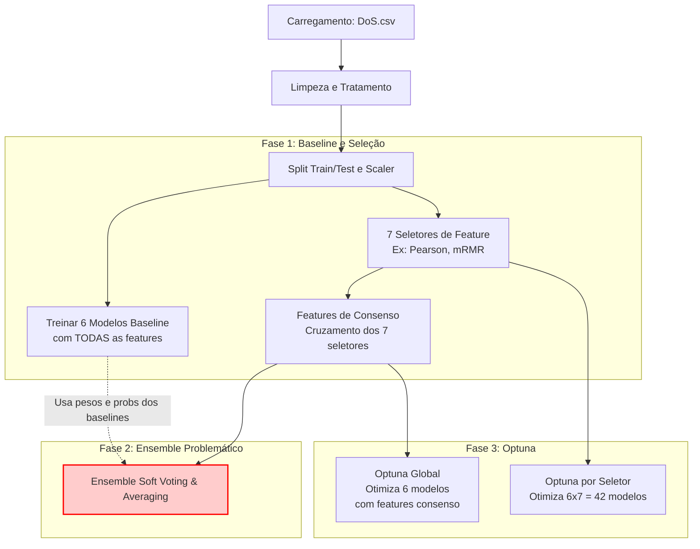
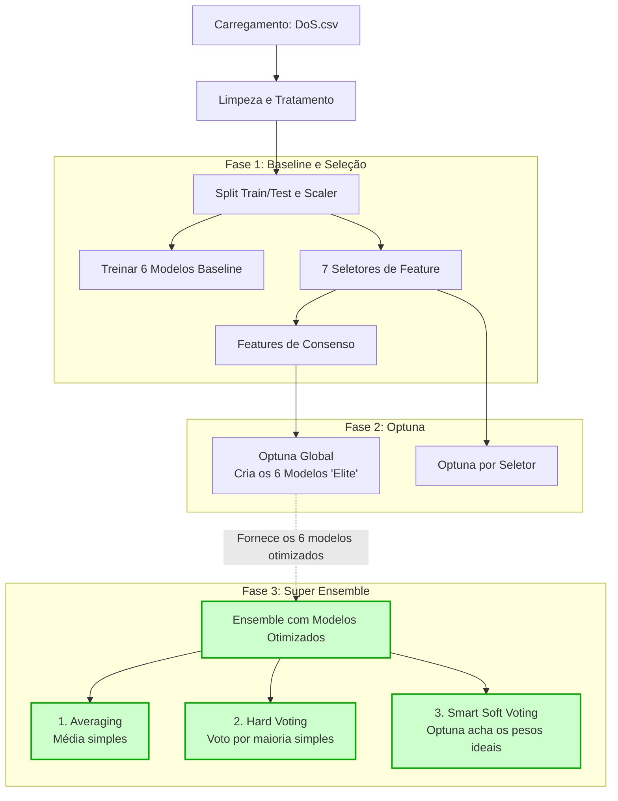

# Entendendo o Pipeline: Atual vs Proposto

Aqui está a visão geral arquitetural do que está acontecendo no seu código e como as peças se encaixam.

## 1. Como está o Pipeline ATUAL (O problema)

No notebook atual, a sequência de execução é exatamente esta:

### O Erro Arquitetural Atual 🚨
Como você pode ver no diagrama, o bloco de Ensemble (`G`) acontece **ANTES** do Optuna (`H`). Ele está pegando os modelos `Baseline` (com parâmetros padrão de fábrica, sem ajuste) e juntando todos eles.

Como vimos nos relatórios, os modelos LDA/QDA/NB têm um F1 base de `~0.92`, enquanto o GradientBoosting tem `~0.975`. Quando você faz um Averaging ou Voting com pesos baseados em F1 nesse momento, o modelo excelente é "puxado para baixo" pelos modelos não-otimizados e fracos.

---

## 2. Como Ficará o Pipeline PROPOSTO (A solução)

A ideia central não é mudar o que você faz, mas **QUANDO** e **COMO** você faz o ensemble. Vamos mover o bloco de Ensemble para depois do Optuna e usar os "Super Modelos" para votar.

### Como os 3 métodos vão funcionar no novo pipeline:

**1. Averaging (Média Simples):**
Vamos pegar as probabilidades dadas pelos **6 Modelos Otimizados pelo Optuna** e somar, dividindo por 6. 
*Por que ainda pode ser fraco?* Porque o LDA/QDA/NB, mesmo otimizados, ainda não passam de ~0.92 de F1. Eles vão continuar diluindo a certeza do Gradient Boosting (F1=0.975).

**2. Hard Voting (Voto Majoritário):**
Em vez de olhar para probabilidades matemáticas, olhamos apenas para a escolha final. "Modelo A diz que é MQTT_Publish, Modelo B diz que é Normal". A classe que tiver mais de 3 votos vence.
*Por que é útil?* Evita que um modelo excessivamente confiante (que dá probabilidade 99.9% para uma classe errada) estrague a média dos outros.

**3. Smart Soft Voting (O Pulo do Gato com Optuna):**
Em vez da conta atual do notebook (`Peso = F1 do modelo / Soma dos F1`), nós vamos **usar o Optuna no próprio Ensemble**.
- O Optuna vai testar milhões de combinações de pesos rapidamente.
- Ele vai perceber sozinho a matemática óbvia: *"O GradientBoosting acerta tudo e o QDA erra muito. Vou dar Peso 0.80 para o GB, 0.20 para o RF, e Peso ZERO para o QDA e LDA"*.
- **Resultado:** O ensemble final será perfeito, silenciando os modelos fracos e amplificando os modelos fortes de forma automática.
