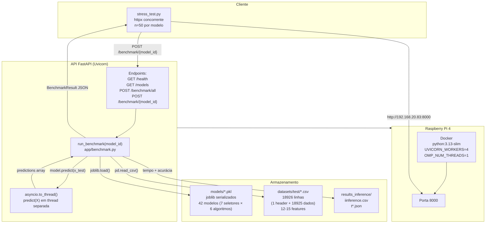

# Arquitetura da API de Inferência



## Componentes

### Endpoints

| Endpoint | Método | Descrição |
|---|---|---|
| `/health` | GET | Status do servidor + diretórios |
| `/models` | GET | Lista modelos compatíveis |
| `/stats` | GET | CPU, memória, workers |
| `/benchmark` | POST | Executa benchmark em todos os modelos |
| `/benchmark/{model_id}` | POST | Executa benchmark em um modelo específico |

### Pipeline de benchmark (`app/benchmark.py`)

1. `discover_models()` — varre `models/*.pkl`, verifica compatibilidade com datasets
2. `run_benchmark(model_id)` — carrega modelo + dataset, executa predict, mede tempo
3. O predict roda **batch completo** (18925 linhas) em `asyncio.to_thread()` para não travar o event loop
4. Métricas retornadas: `inference_time_ms`, `avg_inference_ms_per_row`, `predictions_per_sec`, `accuracy`

### Modelos deployados

Apenas modelos individuais otimizados por Optuna (sem ensemble). 42 arquivos `.pkl` combinando 7 seletores de features com 6 algoritmos:

**Seletores:** ExtraTrees, Fisher, LassoCV, LinearSVC L1, LowVariance, MRMR, Pearson

**Algoritmos:** LDA, DecisionTree, GaussianNB, QDA, RandomForest, GradientBoosting + SVM (só LowVariance)

### Datasets de teste

Cada modelo tem seu próprio CSV de teste em `datasets/test/test_optuna_by_selector_{seletor}_{modelo}.csv`. Todos têm **18926 linhas** (1 cabeçalho + 18925 dados) com 12 ou 15 features + coluna `type` (rótulo).

### Resultados

- `iinference.csv` — resultado do último benchmark unitário
- `t*_workers*_concurrency*_*.json` — resultados completos dos stress tests (tempos individuais por requisição)
- `t*_workers*_concurrency*_*.csv` — agregados por modelo (média, p50, IC95%)
- `inference_time_ci95_lowvariance.csv` — IC95% agregado de todas as execuções
- `inference_stats_by_run_lowvariance.csv` — estatísticas por execução

## Fluxo de uma requisição típica

```
Client → POST /benchmark/lowvariance_decisiontree
  → run_benchmark("lowvariance_decisiontree")
    → joblib.load("models/optuna_by_selector_lowvariance_decisiontree.pkl")
    → pd.read_csv("datasets/test/test_optuna_by_selector_lowvariance_decisiontree.csv")
    → model.predict(x_test)              # 18925 linhas, batch
    → inference_time_ms = 107.22 ms      # total do batch
    → avg = 107.22 / 18925 = 0.00566 ms  # por linha
  → retorna BenchmarkResult JSON
```

## Stress test

`stress_test.py` envia N requisições concorrentes ao `/benchmark/{model_id}` e coleta:

- Tempo de cada requisição (inference_times_ms)
- Throughput (req/s)
- Taxa de timeouts e falhas
- Uso de CPU e memória antes/depois

O run principal usado nas análises de Pareto foi o **t16** (concorrência=15, n=50 por modelo), disponível em `results_inference/t16_workers4_concurrency15_allmodels.csv`.

## Observações

- `OMP_NUM_THREADS=1` evita oversubscription com múltiplos workers Uvicorn
- O tempo de inferência mede **apenas** `model.predict()`, sem incluir I/O de disco (load do modelo e leitura do dataset são medidos separadamente)
- SVM só tem dataset para o seletor LowVariance — os outros seletores não têm modelo SVM deployado
