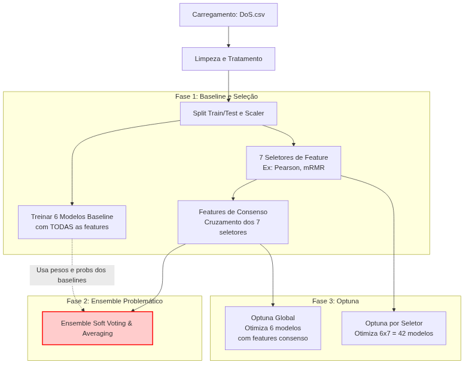
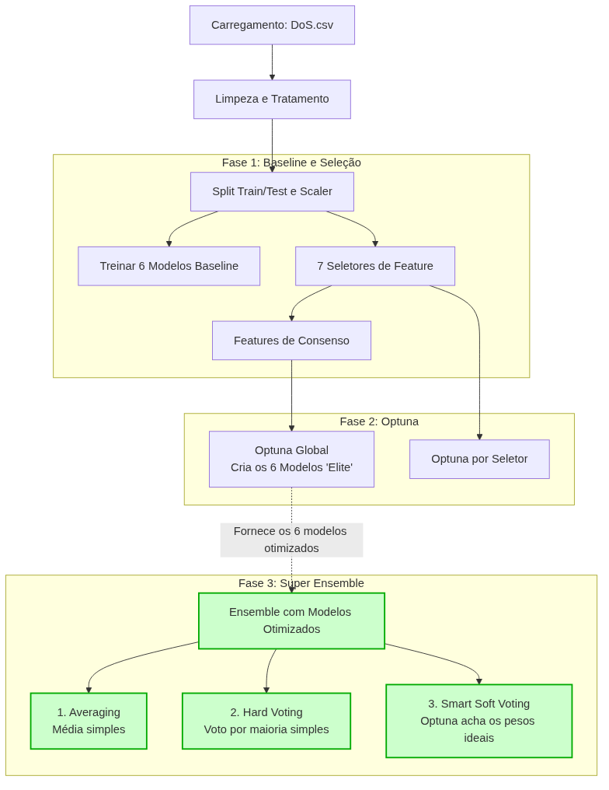
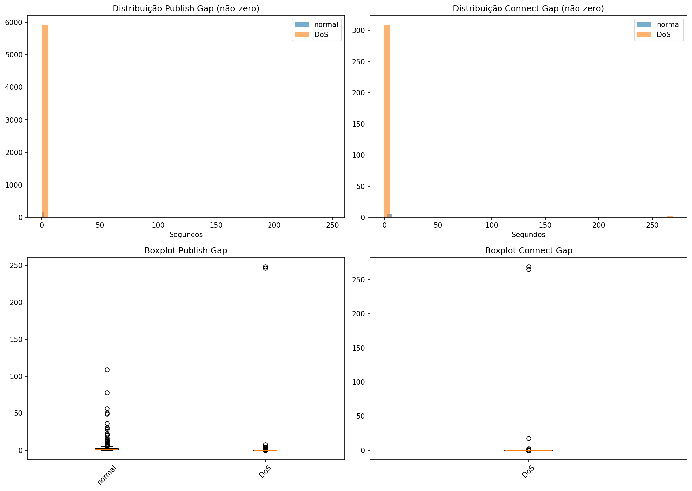
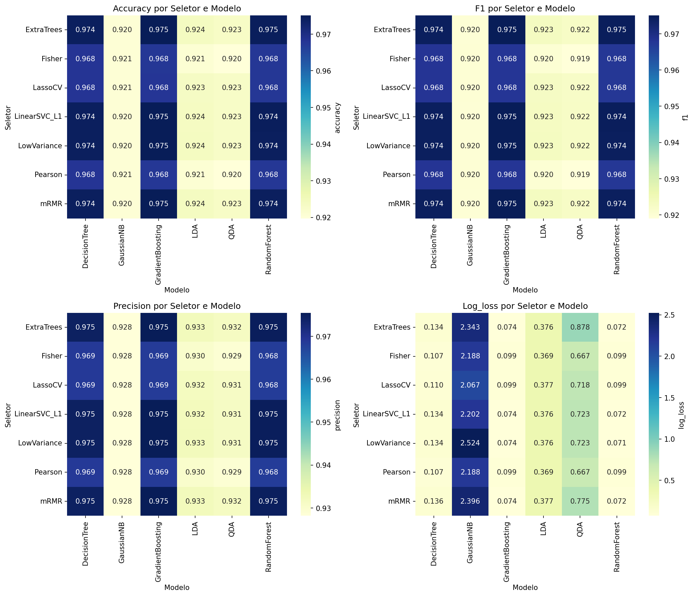
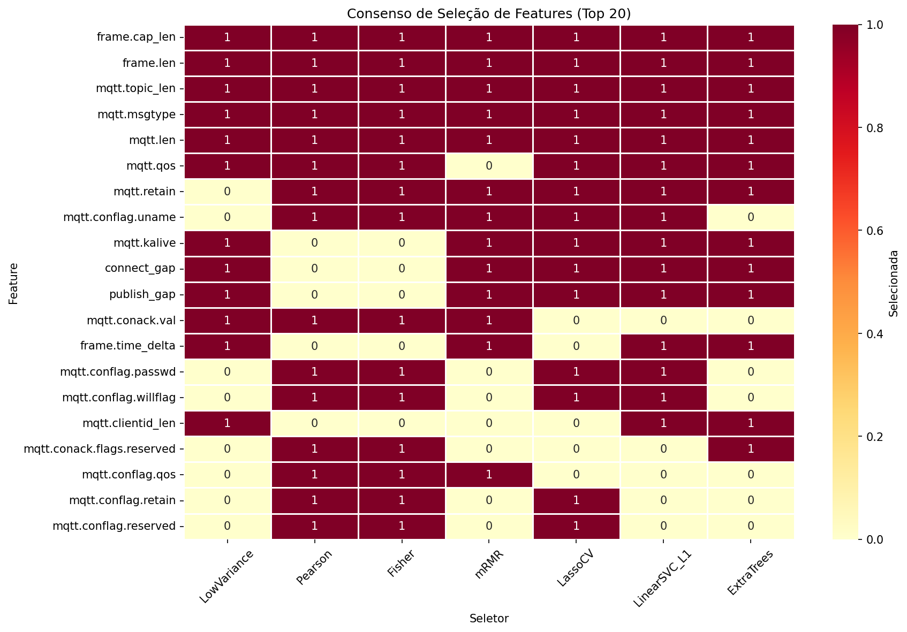
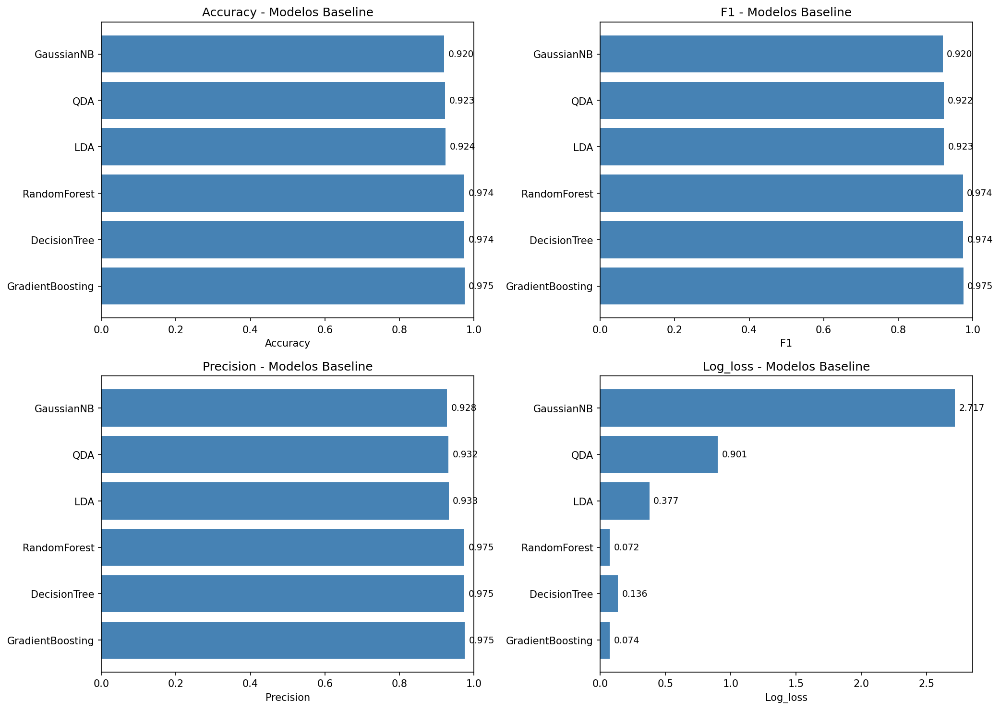
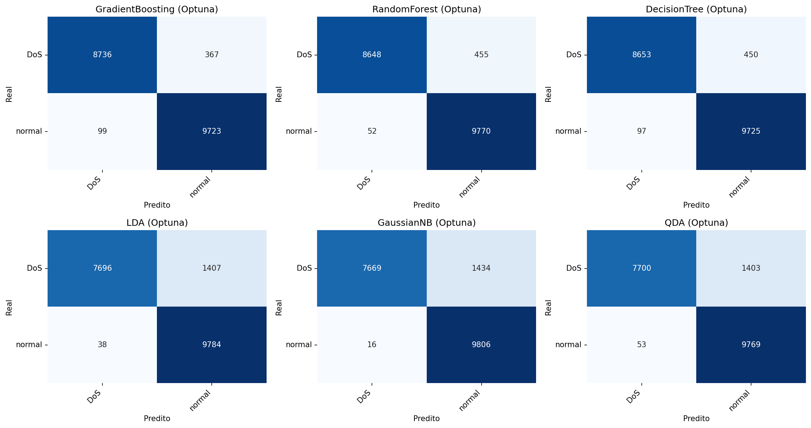
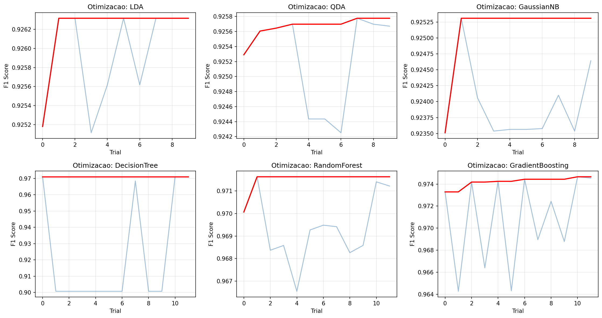
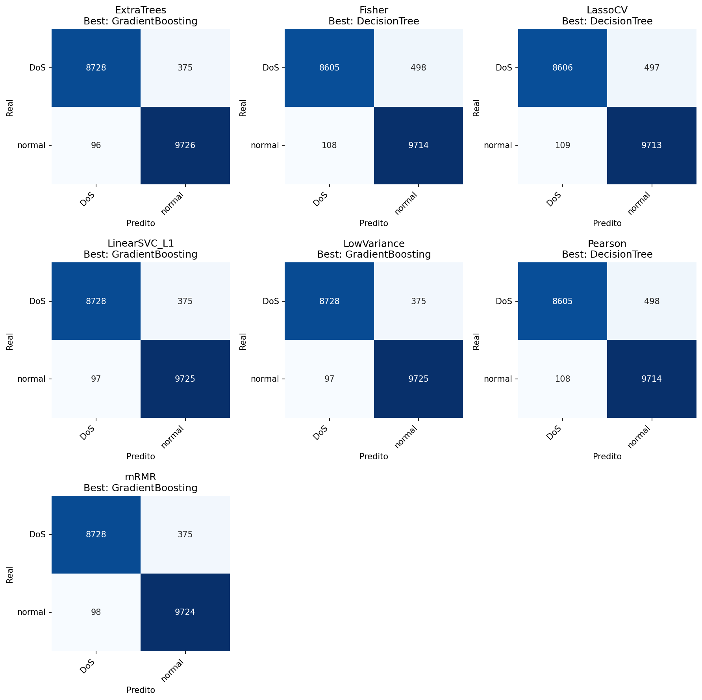
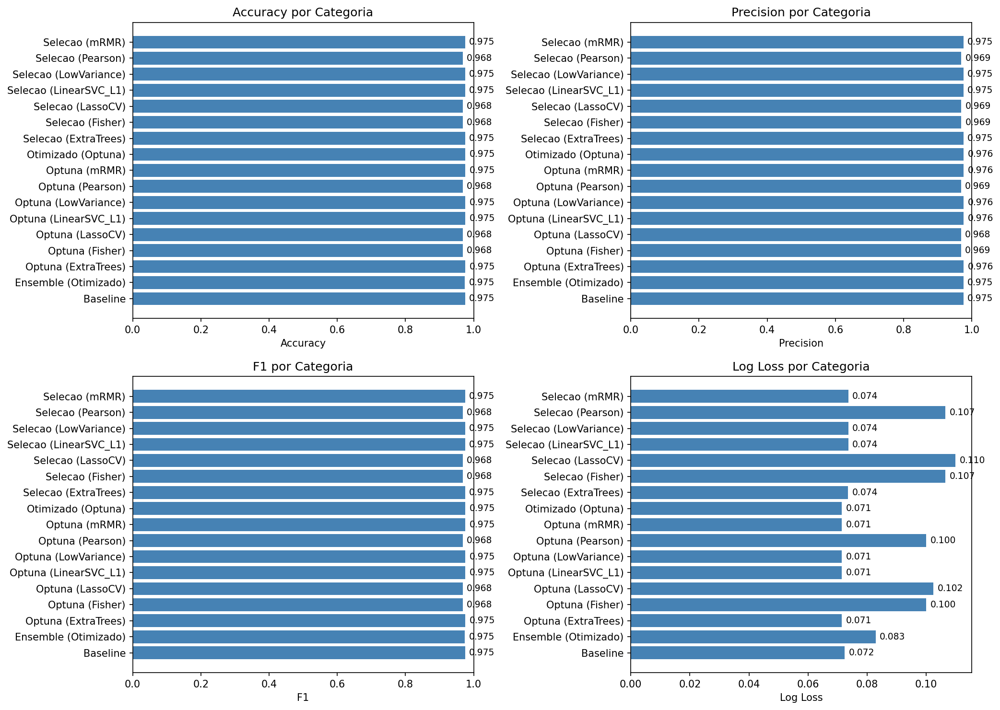

# Relatório Detalhado — Detecção de Ataques DoS em MQTT (Ensemble + Optuna)

**Data de geração:** 2026-05-05  
**Escopo:** cenário DoS, classificação binária (*normal* vs *DoS*)  
**Artefatos base:** `reports/reports_ensemble_v2/RELATORIO_FINAL.md`, `notebooks_refactored/03_pipeline_05_05.ipynb`, e CSV/JSON em `reports/reports_ensemble_v2/`

---

## Visão geral do pipeline (atual vs proposto)

A Figura 1 resume o fluxo executado para geração de features, seleção, otimização e avaliação. A Figura 2 apresenta o **pipeline proposto** (conforme `new_pipeline_proposal.md`), com ênfase em maior modularização e clareza das etapas (feature engineering → seleção → otimização → ensemble → deploy).

**Figura 1 — Pipeline atual (executado).**



**Figura 2 — Pipeline novo (proposta).**



---

## 1. Base de dados

### 1.1 Fonte e organização

- Dataset: **MQTT Under Attack Dataset**
- Arquivo do cenário DoS: `data/raw/MQTT Under Attack Dataset/DoS.csv`
- Variável alvo: coluna `type` com duas classes: `normal` e `DoS`

### 1.2 Dimensão e balanceamento

A inspeção do arquivo `DoS.csv` indica:

- Total de amostras: **94.625**
- Número de colunas: **67**
- Distribuição do alvo (`type`):
  - `normal`: **49.111**
  - `DoS`: **45.514**

Ou seja, trata-se de um conjunto relativamente equilibrado (sem desbalanceamento extremo).

### 1.3 Pré-processamento (conforme notebook final)

No pipeline final (`notebooks_refactored/03_pipeline_05_05.ipynb`), o pré-processamento foi conduzido com foco em evitar vazamento (*data leakage*):

- **Split treino/teste:** `train_test_split(test_size=0.2, stratify=y, random_state=42)`
- **Imputação pós-split:** `SimpleImputer(strategy='constant', fill_value=0)` ajustado apenas em `X_train` e aplicado em `X_test`.
- **Normalização (StandardScaler):** aplicada apenas aos modelos em `MODELS_REQUIRING_SCALING = {'LDA', 'QDA'}`.

### 1.4 Features derivadas de “gaps”

O conjunto de features utilizadas pelos seletores inclui variáveis derivadas relacionadas a intervalos temporais/ocorrência:

- `publish_gap`
- `connect_gap`

A Figura 3 mostra a distribuição dessas features (artefato já gerado no pipeline).

**Figura 3 — Distribuição das gap-features.**



---

## 2. Seletores de features e consenso

### 2.1 Seletores avaliados

Foram executados 7 seletores de features:

- **LowVariance** (baixa variância)
- **Pearson** (correlação)
- **Fisher** (Fisher Score)
- **mRMR** (mínima redundância / máxima relevância)
- **LassoCV** (L1 com validação)
- **LinearSVC_L1** (L1 em SVM linear)
- **ExtraTrees** (importância por árvores extremamente aleatórias)

Os conjuntos selecionados foram salvos em `reports/reports_ensemble_v2/selected_features.json`.

### 2.2 Visualizações da seleção

A Figura 4 resume o “mapa” de seleção por seletor (features selecionadas vs seletor), e a Figura 5 destaca a interseção/consenso entre seletores.

**Figura 4 — Heatmap de seleção de features por seletor.**



**Figura 5 — Heatmap de consenso de features.**



### 2.3 Regra de consenso

A regra de consenso do pipeline final foi:

- Para cada feature, contar em quantos seletores ela aparece.
- Definir `consensus_threshold = len(selectors) // 2 + 1`.
- Selecionar features com `count >= consensus_threshold`.

Como há 7 seletores, o threshold é **4** (maioria simples).

**Features de consenso (16 features; frequência ≥ 4 seletores):**

- `frame.cap_len` (7)
- `mqtt.len` (7)
- `mqtt.msgtype` (7)
- `mqtt.topic_len` (7)
- `frame.len` (6)
- `mqtt.qos` (6)
- `mqtt.retain` (6)
- `connect_gap` (5)
- `mqtt.conflag.uname` (5)
- `mqtt.kalive` (5)
- `publish_gap` (5)
- `frame.time_delta` (4)
- `mqtt.conack.val` (4)
- `mqtt.conflag.passwd` (4)
- `mqtt.conflag.qos` (4)
- `mqtt.conflag.willflag` (4)

---

## 3. Optuna (ranges, budgets) e ensemble pós-Optuna

### 3.1 Configuração do Optuna

- **Sampler:** TPE (`TPESampler(seed=42)`)
- **Métrica de otimização:** `f1_weighted`
- **Validação interna:** `cv=3` folds em `X_train`
- **Tratamento de falhas:** trials inválidos são *pruned* (retornam NaN/erro → `TrialPruned`)

### 3.2 Budget de trials por modelo

Foi usado budget reduzido por modelo (global e por seletor):

- `LDA`: 10
- `QDA`: 10
- `GaussianNB`: 10
- `DecisionTree`: 12
- `RandomForest`: 12
- `GradientBoosting`: 12

### 3.3 Espaços de busca (ranges) por modelo

A seguir, os espaços de busca efetivamente usados em `build_model_from_trial` (notebook final):

| Modelo | Hiperparâmetros (Optuna) |
|---|---|
| LDA | `solver ∈ {svd, lsqr}`; se `lsqr`: `shrinkage ∈ [0.0, 0.3]`; `tol ∈ [1e-6, 1e-3]` (log) |
| QDA | `reg_param ∈ [1e-4, 0.1]` (log) |
| GaussianNB | `var_smoothing ∈ [1e-9, 1e-5]` (log) |
| DecisionTree | `max_depth ∈ [4, 8]`; `min_samples_split ∈ [20, 100]`; `min_samples_leaf ∈ [20, 100]`; `max_features ∈ {None, sqrt, log2}` |
| RandomForest | `n_estimators ∈ [100, 300]`; `max_depth ∈ [6, 12]`; `min_samples_split ∈ [20, 100]`; `min_samples_leaf ∈ [10, 50]`; `max_features ∈ {sqrt, log2}`; `max_samples ∈ [0.7, 1.0]` |
| GradientBoosting | `n_estimators ∈ [30, 200]`; `max_depth ∈ [2, 8]`; `learning_rate ∈ [0.01, 0.3]` (log); `min_samples_split ∈ [2, 15]` |

### 3.4 Optuna global vs Optuna por seletor

- **Optuna global:** otimiza hiperparâmetros usando **apenas as features de consenso**.
- **Optuna por seletor:** repete a otimização para cada seletor, usando o conjunto de features selecionadas por ele. Além disso, salva os modelos gerados em:
  - `models/models_ensemble_v2/optuna/`
  - `models/models_ensemble_v2/base/`

### 3.5 Ensemble pós-Optuna

Foram avaliados 3 métodos de ensemble (com base nas predições dos modelos otimizados):

- **Averaging**: média das probabilidades.
- **Hard Voting**: votação majoritária via classes preditas.
- **Smart Soft Voting**: **otimização de pesos via Optuna** com `n_trials=100`.

No *Smart Soft Voting*, para cada modelo $m$ do conjunto, o Optuna amostra um peso $w_m \in [0,1]$, normaliza $\sum_m w_m = 1$ e maximiza $F1_{weighted}$.

---

## 4. Resultados (métricas, tempos e melhores hiperparâmetros)

### 4.1 Resultado principal

O melhor resultado global reportado foi:

- **Melhor modelo:** `GradientBoosting (Optuna)`
- **Accuracy:** 0.9754
- **Precision:** 0.9757
- **F1:** 0.9754
- **Log loss:** 0.0714

### 4.2 Métricas por etapa

#### Baseline

| Modelo | accuracy | precision | f1 | log_loss |
|---|---:|---:|---:|---:|
| GradientBoosting | 0.975059 | 0.975443 | 0.975040 | 0.073563 |
| DecisionTree | 0.974320 | 0.974573 | 0.974304 | 0.135895 |
| RandomForest | 0.974055 | 0.974682 | 0.974028 | 0.072422 |
| LDA | 0.923857 | 0.932576 | 0.923244 | 0.376601 |
| QDA | 0.923065 | 0.931535 | 0.922457 | 0.901391 |
| GaussianNB | 0.920476 | 0.928173 | 0.919890 | 2.717420 |

**Figura 6 — Comparação de baseline.**



#### Seleção de features — melhor modelo por seletor

| seletor | modelo | n_features | accuracy | precision | f1 | log_loss |
|---|---|---:|---:|---:|---:|---:|
| ExtraTrees | GradientBoosting | 15 | 0.975059 | 0.975443 | 0.975040 | 0.073568 |
| Fisher | DecisionTree | 15 | 0.967979 | 0.968728 | 0.967940 | 0.106537 |
| LassoCV | DecisionTree | 15 | 0.967979 | 0.968720 | 0.967940 | 0.108282 |
| LinearSVC_L1 | GradientBoosting | 15 | 0.975059 | 0.975443 | 0.975040 | 0.073597 |
| LowVariance | GradientBoosting | 12 | 0.975059 | 0.975443 | 0.975040 | 0.073610 |
| Pearson | DecisionTree | 15 | 0.967979 | 0.968728 | 0.967940 | 0.106537 |
| mRMR | GradientBoosting | 15 | 0.975007 | 0.975388 | 0.974987 | 0.073626 |

#### Ensemble

| Método | accuracy | precision | f1 | log_loss |
|---|---:|---:|---:|---:|
| Averaging | 0.925812 | 0.935063 | 0.925189 | 0.114232 |
| Hard Voting | 0.971466 | 0.972126 | 0.971435 | NaN |
| Smart Soft Voting | 0.974320 | 0.975074 | 0.974289 | 0.085658 |

#### Optuna global

| modelo | accuracy | precision | f1 | log_loss |
|---|---:|---:|---:|---:|
| GradientBoosting (Optuna) | 0.975376 | 0.975733 | 0.975358 | 0.071406 |
| RandomForest (Optuna) | 0.973052 | 0.973826 | 0.973019 | 0.088440 |
| DecisionTree (Optuna) | 0.971096 | 0.971715 | 0.971066 | 0.082084 |
| LDA (Optuna) | 0.923646 | 0.932385 | 0.923029 | 0.376519 |
| GaussianNB (Optuna) | 0.923382 | 0.932785 | 0.922725 | 1.193321 |
| QDA (Optuna) | 0.923065 | 0.931535 | 0.922457 | 0.983869 |

**Figura 7 — Matrizes de confusão (Optuna global).**



**Figura 8 — Histórico de otimização (Optuna global).**



#### Optuna por seletor — melhor modelo por seletor

| seletor | modelo | n_features | accuracy | precision | f1 | log_loss |
|---|---|---:|---:|---:|---:|---:|
| ExtraTrees | GradientBoosting | 15 | 0.975376 | 0.975733 | 0.975358 | 0.071406 |
| LowVariance | GradientBoosting | 12 | 0.975376 | 0.975733 | 0.975358 | 0.071406 |
| LinearSVC_L1 | GradientBoosting | 15 | 0.975376 | 0.975733 | 0.975358 | 0.071406 |
| mRMR | GradientBoosting | 15 | 0.975376 | 0.975733 | 0.975358 | 0.071406 |
| Fisher | GradientBoosting | 15 | 0.967926 | 0.968528 | 0.967892 | 0.099968 |
| Pearson | GradientBoosting | 15 | 0.967926 | 0.968528 | 0.967892 | 0.099968 |
| LassoCV | GradientBoosting | 15 | 0.967873 | 0.968493 | 0.967839 | 0.102422 |

**Figura 9 — Melhor matriz de confusão por seletor.**



### 4.3 Comparações globais e resultado final

**Figura 10 — Comparação final (todas as etapas/modelos).**



### 4.4 Tempos de execução (resumo)

Os tempos foram medidos com `time.perf_counter()` e agregados por etapa/modelo/seletor.

#### Resumo por etapa

| stage | n_registros | tempo_total_sec | tempo_medio_sec | tempo_min_sec | tempo_max_sec |
|---|---:|---:|---:|---:|---:|
| optuna_by_selector_optimization | 42 | 1203.86 | 28.6633 | 3.71955 | 136.598 |
| optuna_global_optimization | 6 | 217.934 | 36.3224 | 3.87237 | 137.719 |
| optuna_by_selector_training | 42 | 80.1230 | 1.90769 | 0.06509 | 11.0037 |
| feature_selection_selector_total | 7 | 49.1374 | 7.01963 | 5.11914 | 8.58978 |
| feature_selection | 42 | 41.7721 | 0.99457 | 0.06754 | 5.20033 |
| optuna_global_training | 6 | 15.5744 | 2.59574 | 0.06874 | 11.3587 |
| baseline | 6 | 7.77537 | 1.29590 | 0.07402 | 5.47968 |
| ensemble_smart_voting | 1 | 5.34694 | 5.34694 | 5.34694 | 5.34694 |
| ensemble_hard_voting | 1 | 2.29984 | 2.29984 | 2.29984 | 2.29984 |
| ensemble_averaging | 1 | 0.15904 | 0.15904 | 0.15904 | 0.15904 |

#### Resumo por modelo

| modelo | n_registros | tempo_total_sec | tempo_medio_sec | tempo_min_sec | tempo_max_sec |
|---|---:|---:|---:|---:|---:|
| GradientBoosting | 24 | 982.680 | 40.9450 | 1.27766 | 137.719 |
| RandomForest | 24 | 417.127 | 17.3803 | 1.18422 | 59.2768 |
| QDA | 24 | 49.9054 | 2.07939 | 0.10468 | 6.32439 |
| LDA | 24 | 45.2096 | 1.88373 | 0.10637 | 5.56552 |
| DecisionTree | 24 | 40.7420 | 1.69758 | 0.06509 | 5.21199 |
| GaussianNB | 24 | 31.3733 | 1.30722 | 0.06754 | 3.87237 |

#### Resumo por seletor

| seletor | n_registros | n_features | tempo_total_sec | tempo_medio_sec | tempo_min_sec | tempo_max_sec |
|---|---:|---:|---:|---:|---:|---:|
| LowVariance | 19 | 12 | 244.426 | 12.8645 | 0.06830 | 134.731 |
| mRMR | 19 | 15 | 239.831 | 12.6227 | 0.06783 | 136.598 |
| ExtraTrees | 19 | 15 | 232.875 | 12.2566 | 0.06792 | 132.414 |
| LinearSVC_L1 | 19 | 15 | 227.913 | 11.9954 | 0.06789 | 129.955 |
| Pearson | 19 | 15 | 158.054 | 8.31866 | 0.06758 | 80.5047 |
| Fisher | 19 | 15 | 157.225 | 8.27501 | 0.06722 | 79.0421 |
| LassoCV | 19 | 15 | 114.565 | 6.02975 | 0.06509 | 47.4174 |

### 4.5 Melhores hiperparâmetros (resumo)

Os melhores hiperparâmetros do Optuna global (por F1 em CV) foram:

- **GradientBoosting:** `{"n_estimators": 191, "max_depth": 6, "learning_rate": 0.03504750508385013, "min_samples_split": 11}`
- **RandomForest:** `{"n_estimators": 296, "max_depth": 10, "min_samples_split": 98, "min_samples_leaf": 10, "max_features": "log2", "max_samples": 0.7198645099727456}`
- **DecisionTree:** `{"max_depth": 5, "min_samples_split": 97, "min_samples_leaf": 79, "max_features": null}`
- **LDA:** `{"solver": "svd", "tol": 1.493656855461763e-06}`
- **QDA:** `{"reg_param": 0.0396760507705299}`
- **GaussianNB:** `{"var_smoothing": 6.351221010640695e-06}`

---

## 5. Conclusão e deploy em Raspberry Pi

### 5.1 Conclusões técnicas

- O melhor desempenho global foi obtido por **GradientBoosting otimizado via Optuna**, com $F1_{weighted}\approx 0.9754$.
- A **seleção de features** foi estável: quatro features aparecem em todos os seletores (`mqtt.len`, `mqtt.msgtype`, `mqtt.topic_len`, `frame.cap_len`), e o consenso (threshold=4) resultou em **16 features**.
- O custo computacional é dominado por **Optuna por seletor** (≈ 1204 s no agregado), seguido por Optuna global (≈ 218 s).

### 5.2 Deploy no Raspberry Pi (resumo operacional)

A proposta de deploy é executar inferência leve no edge, carregando um modelo treinado e aplicando predição em fluxo MQTT.

**Pré-requisitos (Raspberry Pi OS 64-bit recomendado):**

1. Criar venv e instalar dependências principais:

```bash
sudo apt update && sudo apt upgrade -y
sudo apt install -y python3 python3-pip python3-venv
python3 -m venv ~/mqtt_env
source ~/mqtt_env/bin/activate
pip install numpy pandas scikit-learn joblib paho-mqtt
```

2. Transferir modelo e script:

- Modelos (Optuna): `models/models_ensemble_v2/optuna/*.pkl`
- Script de inferência: `scripts/pi_inference.py`

Exemplo (na sua máquina):

```bash
ssh pi@<IP_DO_RASPBERRY> "mkdir -p ~/mqtt_infer/models"
scp models/models_ensemble_v2/optuna/optuna_by_selector_extratrees_gradientboosting.pkl pi@<IP_DO_RASPBERRY>:~/mqtt_infer/models/
scp scripts/pi_inference.py pi@<IP_DO_RASPBERRY>:~/mqtt_infer/
```

3. Executar inferência no Pi:

```bash
source ~/mqtt_env/bin/activate
cd ~/mqtt_infer
python pi_inference.py --model models/optuna_by_selector_extratrees_gradientboosting.pkl --broker 127.0.0.1 --topic "#"
```

4. (Opcional) configurar serviço `systemd` para *autostart*.

Para detalhes completos, ver `raspberry_deploy.md`.

---

## Apêndices (tabelas autogeradas)

Conteúdo gerado automaticamente em `reports/reports_ensemble_v2/_tables_autogen.md`:

## Apêndice A — Melhores hiperparâmetros (Optuna Global)

| modelo           |   best_f1_cv | best_params                                                                                                                                        |
|:-----------------|-------------:|:---------------------------------------------------------------------------------------------------------------------------------------------------|
| GradientBoosting |     0.974659 | {"n_estimators": 191, "max_depth": 6, "learning_rate": 0.03504750508385013, "min_samples_split": 11}                                               |
| RandomForest     |     0.972321 | {"n_estimators": 296, "max_depth": 10, "min_samples_split": 98, "min_samples_leaf": 10, "max_features": "log2", "max_samples": 0.7198645099727456} |
| DecisionTree     |     0.971031 | {"max_depth": 5, "min_samples_split": 97, "min_samples_leaf": 79, "max_features": null}                                                            |
| LDA              |     0.926316 | {"solver": "svd", "tol": 1.493656855461763e-06}                                                                                                    |
| QDA              |     0.925776 | {"reg_param": 0.0396760507705299}                                                                                                                  |
| GaussianNB       |     0.925308 | {"var_smoothing": 6.351221010640695e-06}                                                                                                           |

## Apêndice B — Melhor par (seletor, modelo) no teste (Optuna por seletor)

| seletor      | modelo           |   n_features |   accuracy |   precision |       f1 |   log_loss |
|:-------------|:-----------------|-------------:|-----------:|------------:|---------:|-----------:|
| ExtraTrees   | GradientBoosting |           15 |   0.975376 |    0.975733 | 0.975358 |  0.0714057 |
| LowVariance  | GradientBoosting |           12 |   0.975376 |    0.975733 | 0.975358 |  0.0714057 |
| LinearSVC_L1 | GradientBoosting |           15 |   0.975376 |    0.975733 | 0.975358 |  0.0714057 |
| mRMR         | GradientBoosting |           15 |   0.975376 |    0.975733 | 0.975358 |  0.0714057 |
| Fisher       | GradientBoosting |           15 |   0.967926 |    0.968528 | 0.967892 |  0.0999679 |
| Pearson      | GradientBoosting |           15 |   0.967926 |    0.968528 | 0.967892 |  0.0999679 |
| LassoCV      | GradientBoosting |           15 |   0.967873 |    0.968493 | 0.967839 |  0.102422  |

## Apêndice C — Tempos por etapa (resumo)

| stage                            |   n_registros |   tempo_total_sec |   tempo_medio_sec |   tempo_min_sec |   tempo_max_sec |
|:---------------------------------|--------------:|------------------:|------------------:|----------------:|----------------:|
| optuna_by_selector_optimization  |            42 |       1203.86     |         28.6633   |       3.71955   |      136.598    |
| optuna_global_optimization       |             6 |        217.934    |         36.3224   |       3.87237   |      137.719    |
| optuna_by_selector_training      |            42 |         80.123    |          1.90769  |       0.0650877 |       11.0037   |
| feature_selection_selector_total |             7 |         49.1374   |          7.01963  |       5.11914   |        8.58978  |
| feature_selection                |            42 |         41.7721   |          0.994574 |       0.0675365 |        5.20033  |
| optuna_global_training           |             6 |         15.5744   |          2.59574  |       0.0687415 |       11.3587   |
| baseline                         |             6 |          7.77537  |          1.2959   |       0.0740205 |        5.47968  |
| ensemble_smart_voting            |             1 |          5.34694  |          5.34694  |       5.34694   |        5.34694  |
| ensemble_hard_voting             |             1 |          2.29984  |          2.29984  |       2.29984   |        2.29984  |
| ensemble_averaging               |             1 |          0.159039 |          0.159039 |       0.159039  |        0.159039 |

## Apêndice D — Tempos por modelo (resumo)

| modelo           |   n_registros |   tempo_total_sec |   tempo_medio_sec |   tempo_min_sec |   tempo_max_sec |
|:-----------------|--------------:|------------------:|------------------:|----------------:|----------------:|
| GradientBoosting |            24 |          982.68   |          40.945   |       1.27766   |       137.719   |
| RandomForest     |            24 |          417.127  |          17.3803  |       1.18422   |        59.2768  |
| QDA              |            24 |           49.9054 |           2.07939 |       0.104684  |         6.32439 |
| LDA              |            24 |           45.2096 |           1.88373 |       0.10637   |         5.56552 |
| DecisionTree     |            24 |           40.742  |           1.69758 |       0.0650877 |         5.21199 |
| GaussianNB       |            24 |           31.3733 |           1.30722 |       0.0675365 |         3.87237 |

## Apêndice E — Tempos por seletor (resumo)

| seletor      |   n_registros |   n_features |   tempo_total_sec |   tempo_medio_sec |   tempo_min_sec |   tempo_max_sec |
|:-------------|--------------:|-------------:|------------------:|------------------:|----------------:|----------------:|
| LowVariance  |            19 |           12 |           244.426 |          12.8645  |       0.0683038 |        134.731  |
| mRMR         |            19 |           15 |           239.831 |          12.6227  |       0.0678309 |        136.598  |
| ExtraTrees   |            19 |           15 |           232.875 |          12.2566  |       0.0679207 |        132.414  |
| LinearSVC_L1 |            19 |           15 |           227.913 |          11.9954  |       0.0678928 |        129.955  |
| Pearson      |            19 |           15 |           158.054 |           8.31866 |       0.0675844 |         80.5047 |
| Fisher       |            19 |           15 |           157.225 |           8.27501 |       0.067222  |         79.0421 |
| LassoCV      |            19 |           15 |           114.565 |           6.02975 |       0.0650877 |         47.4174 |
